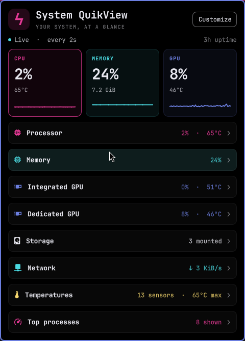
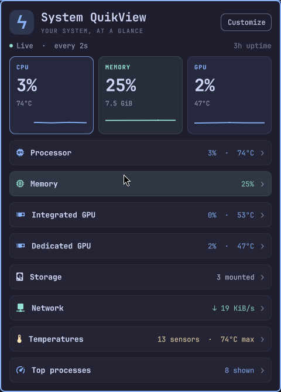
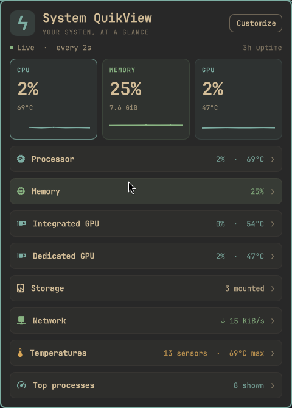
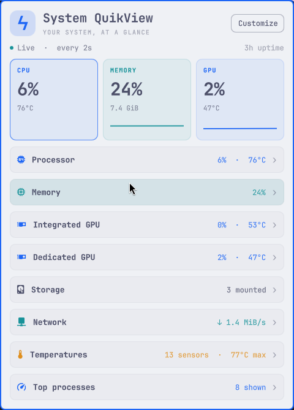

<div align="center">

# System QuikView

**Your system, at a glance.**

A native Omarchy system monitor with a compact bar readout, live graphs, and a dashboard you can make your own.

[Install](#install) · [Screenshots](docs/screenshots.md) · [Customize](#make-it-yours) · [Hardware support](#hardware-support)



</div>

## A quick look, without opening another app

QuikView puts the essentials in your bar and the details one click away. See what is busy, what is warm, and where your memory is going—then collapse the sections you do not need.

- **Choose your bar reading.** CPU, memory, GPU usage, temperatures, VRAM, download speed, disk usage, or an icon alone.
- **Keep the popup still.** The bar fits its text naturally. The open dashboard stays anchored as readings and selections change.
- **Make the layout yours.** Move sections up or down, including individual GPU cards. Your order and collapsed sections survive restarts.
- **Follow your theme.** Text, highlights, graphs, and warning colors come from the active Omarchy theme, with live palette updates.
- **See both sides of the network.** Separate download/upload graphs, per-interface rates, and transfer counters. Inactive interfaces are tucked behind a toggle.
- **Read temperatures by device.** CPU, graphics, storage, and other sensors have grouped cards, gauges, and hardware-reported warning limits.
- **Find busy processes.** Ranked cards show process names, PIDs, CPU usage, memory, and comparison bars.

QuikView reads Linux telemetry directly. **It does not require btop, a cloud account, a root service, or Python packages from pip.**

## Install

Requires **Omarchy Shell/Quickshell**, its native plugin API, and **Python 3**. This is an Omarchy Shell plugin, not a Waybar module. Tested on Omarchy **4.0.3-1** with Quickshell **0.3.1**; older shells may not provide the required APIs.

```sh
omarchy plugin add https://github.com/onelegdave/system-quikview.git --enable
```

Omarchy will prompt before installing and let you choose where to place it. If you installed without enabling:

```sh
omarchy plugin enable onelegdave.system-quikview --section right
```

### Install from a local checkout

```sh
git clone https://github.com/onelegdave/system-quikview.git
cd system-quikview
python3 install.py
```

The local installer backs up your shell configuration and any previous local plugin version, then copies the runtime files into `~/.config/omarchy/plugins/onelegdave.system-quikview`. It also migrates the early `onelegdave.btop` prototype while preserving its placement and preferences.

`onelegdave` is the publisher namespace—not a requirement to use that username. Packaged Omarchy files are never modified.

### Update or remove

For an installation made with `omarchy plugin add`:

```sh
omarchy plugin update onelegdave.system-quikview
```

For a local checkout, run `git pull` in the checkout and then `python3 install.py` again. If Quickshell retains an old component after an update, run `omarchy restart shell`.

```sh
omarchy plugin disable onelegdave.system-quikview
# Or remove it entirely:
omarchy plugin remove onelegdave.system-quikview
```

## Make it yours

**Click** the bar reading to open the dashboard. **Right-click** it, or use the **Customize** button, to open settings.

| Control | What it does |
| --- | --- |
| CPU / Memory / GPU overview card | Pins that metric to the bar |
| Section heading | Expands or collapses details |
| Customize → Section order | Moves sections with ↑ and ↓ |
| Customize → Top bar reading | Selects the bar metric |
| Customize → GPU source | Selects which GPU supplies its readings |
| GPU card → Pin temperature | Pins that specific GPU’s temperature |
| Default order | Restores the dashboard’s original section order |
| Done | Returns to the dashboard |

Use the mouse wheel or arrow/Page Up/Page Down keys to scroll. Escape closes the popup.

### GPU selection

QuikView supports separate cards for multiple detected GPUs. The source selector controls the **GPU**, **GPU temperature**, and **VRAM** bar readings and the GPU overview card.

| Source | Behavior |
| --- | --- |
| Auto · prefer dedicated | Prefers a dedicated GPU with an available reading, then falls back to another GPU |
| Dedicated / Integrated | Uses the first device assigned that role |
| Hottest GPU | Follows the GPU with the highest reported temperature |
| A named device | Pins a specific GPU by its PCI address |

Auto checks availability per metric, so usage and temperature can come from different devices. The GPU temperature tooltip names the source. Choose a named device when you want an exact match, especially with more than one dedicated GPU.

An explicitly selected device stays selected if it disconnects; the reading becomes unavailable instead of silently switching. Saved section preferences are retained for disconnected GPUs. New devices are added to the layout automatically.

**GPU role overrides** let you label a device as integrated or dedicated when its driver cannot identify the role. Direct device selection works independently of these labels.

## At home in your theme

<table>
<tr>
<th>Catppuccin</th>
<th>Gruvbox</th>
<th>Catppuccin Latte</th>
</tr>
<tr>
<td></td>
<td></td>
<td></td>
</tr>
</table>

Colors come from the installed theme: popup text and surfaces, the accent, named cyan/blue/yellow colors (or numbered palette colors 6/4/3), and the urgent color. Missing palette entries fall back to the theme accent. Translucent fills and borders derive from those same colors.

[See the feature gallery →](docs/screenshots.md)

## Hardware support

QuikView reports what the running Linux kernel and drivers make available. A missing sensor displays **—**, not a false zero.

| Area | Source and support |
| --- | --- |
| CPU, RAM, swap, processes | Linux `/proc` |
| Network | `/proc/net/dev` and interface information in sysfs |
| Storage | Mounted local block filesystems |
| Temperature sensors | Linux hwmon, plus GPU temperature when supplied by the GPU collector |
| AMD GPU | sysfs readings; optional `libdrm_amdgpu` identifies integrated vs. dedicated |
| NVIDIA GPU | `nvidia-smi`, when installed and working |
| Intel / other GPUs | Detected through DRM; only exposed sysfs readings are available. A role can be assigned manually |

Tested live on an AMD integrated / NVIDIA dedicated laptop. Intel and other GPU combinations are **not** yet hardware-validated. Software tests cover no GPU, a single GPU, multiple GPUs, missing readings, device selection, and reconnection-related layout behavior.

Optional `lspci` improves device names. NVIDIA queries have a timeout. Nothing is installed automatically by the telemetry collector.

## What the numbers mean

- **CPU:** overall utilization across threads. Process CPU uses **100% per fully occupied thread** and may exceed 100%.
- **Memory:** total RAM minus available RAM; reclaimable cache is excluded. Swap is separate.
- **History:** the latest 60 samples, kept in memory. CPU/GPU/RAM graphs use a 0–100% scale. Network graphs scale independently to their recent peaks.
- **Temperatures:** high/critical labels use valid limits reported by the hardware. Without a limit, a gauge uses a labeled 0–100°C visual scale. CPU temperature is the highest supported CPU sensor reading.
- **Network:** bar and overview rates aggregate non-loopback interfaces. Virtual interfaces can double-count traffic. Received/sent totals are interface counters, not totals since opening QuikView.
- **Disks:** one mount per local block device. The bar uses the first mount, normally `/`.
- **Processes:** ranked by current CPU usage, then resident memory. Each comparison-bar column is scaled to its highest visible reading.

### Change the refresh interval

Readings refresh every **2 seconds** by default. To refresh every **5 seconds**, run this in a terminal:

```sh
omarchy bar set onelegdave.system-quikview interval 5 --json
```

Replace `5` with any whole number from **1–30**. The number is the time between updates in seconds. The setting saves automatically and applies without restarting.

To restore the **2-second default**:

```sh
omarchy bar set onelegdave.system-quikview interval 2 --json
```

Collection continues while the popup is closed. Each bar instance currently runs its own collector; multi-monitor collection is not yet shared.

## Troubleshooting

**The plugin is installed but not visible:** enable it with the command above, then check `omarchy-shell shell ping`.

**A GPU reading is unavailable:** check whether the driver exposes it. For NVIDIA, verify `nvidia-smi` works. Try selecting the device explicitly in Customize. Installing QuikView does not install GPU drivers.

**Colors or code look stale after an update:** run `omarchy restart shell`.

**Settings location:** the widget’s entry in `~/.config/omarchy/shell.json`. Local-installer backups live beside that file and under `~/.config/omarchy/plugin-backups/`.

## Development

```sh
python3 -m unittest -v
node test_model.cjs
./lint-qml.sh
python3 monitor.py --once
omarchy-plugin-validate .
```

Node is used only for development tests. Runtime needs Python and Quickshell.

The main files are `Panel.qml` (dashboard and customization), `monitor.py` (telemetry), `Model.js` (selection and layout logic), `ThemePalette.qml` (theme palette), and `Sparkline.qml` (graphs).

[Contributor notes and diagnostic commands](CONTRIBUTING.md)

## License

[MIT](LICENSE) © OneLegDave
