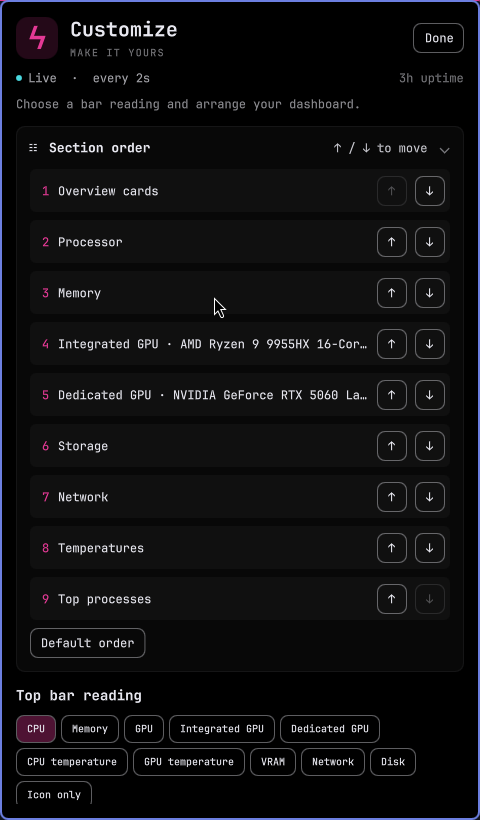
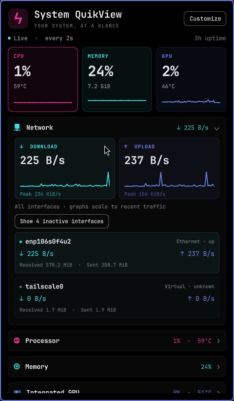
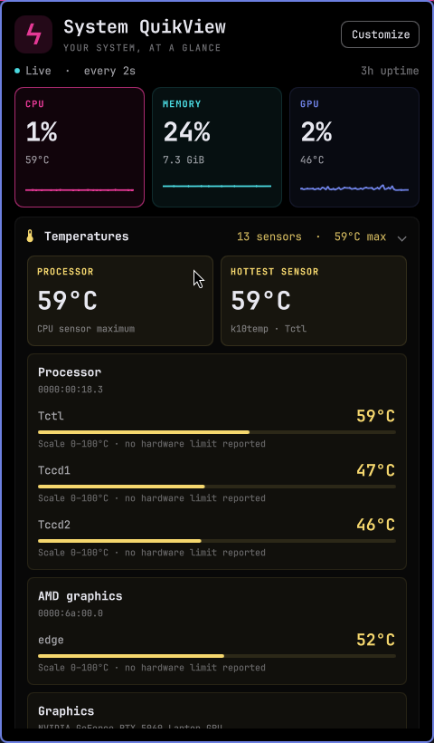
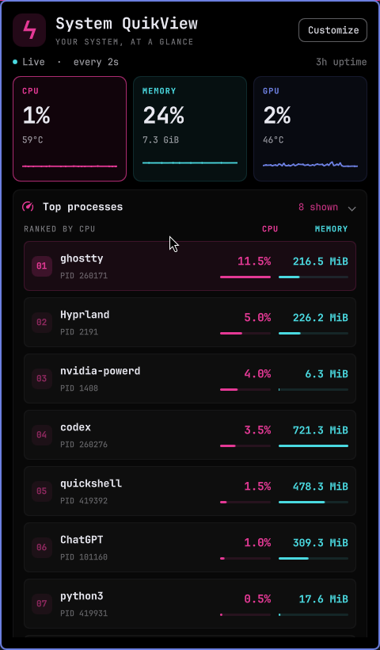

# System QuikView gallery

Real screenshots from Omarchy Shell, using live readings from an AMD integrated / NVIDIA dedicated laptop. Sections are collapsed and reordered to highlight each view; all of these controls are available in Customize. Longer views scroll.

## Overview

## Make it yours

Move sections individually and choose the reading in your bar. GPU source selection and role overrides are farther down the settings view.

## Network

Independent download and upload histories, recent peaks, and per-interface counters. Inactive interfaces can be revealed when needed.

## Temperatures

Device groups keep sensor names, current readings, and hardware limits together. This capture shows the top of the scrollable temperature section.

## Top processes

Ranked process cards pair CPU usage with resident memory. The two comparison bars use separate scales.

## Dark and light themes

These are captures after applying each installed Omarchy theme. QuikView reads the active palette automatically.

| Catppuccin | Gruvbox | Catppuccin Latte |
| --- | --- | --- |
|  |  |  |

[Back to installation and features](../README.md)
